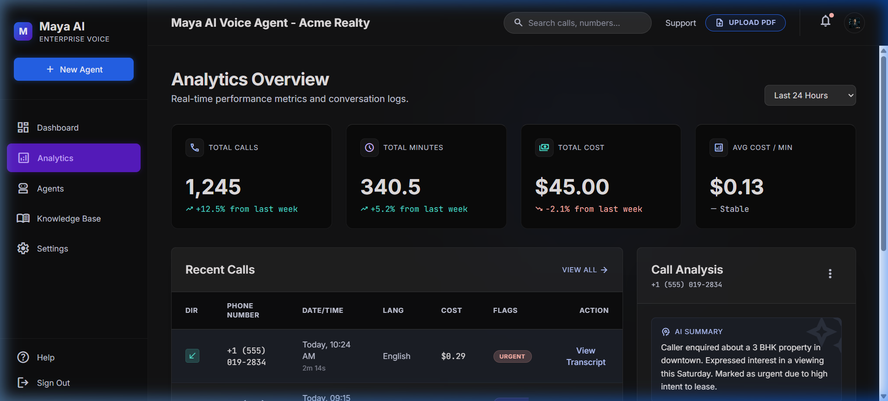
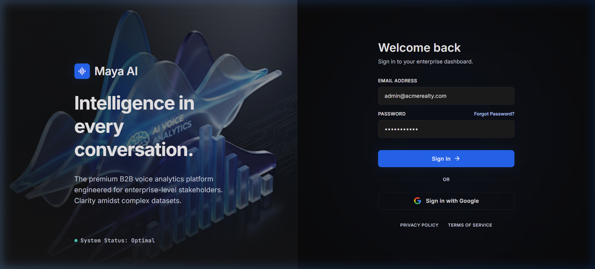

# Maya AI Voice Agent Dashboard

Welcome to the **Maya AI Voice Agent Dashboard**! This is the frontend interface for an enterprise-level B2B voice analytics platform, engineered for clarity amidst complex datasets.

## 🚀 Tech Stack

- **React.js** (Frontend Framework)
- **TypeScript** (Static Typing)
- **Vite** (Build Tool)
- **Tailwind CSS v3** (Utility-first styling & dark-mode glassmorphism)
- **React Router DOM** (Navigation & Routing)

## 🎨 Design System

The application strictly adheres to a premium dark-mode aesthetic featuring:
- Tonal layering and blurred overlays (`backdrop-filter`) for depth.
- **Inter** for standard text and **JetBrains Mono** for technical data/labels.
- Deep charcoal backgrounds (`#0A0A0B`) with electric blue and teal glowing accents.

## 📦 Setup & Installation

To run this project locally, execute the following commands in the root directory:

```bash
# Install dependencies
npm install

# Start the local development server
npm run dev

# Build for production
npm run build
```

The application will typically start at `http://localhost:5173`.

---

## 🖥️ Screen Details & Walkthrough

The application features a fully responsive sidebar navigation that routes between the core capabilities of the platform.

### 1. Analytics Dashboard
**Route: `/analytics`**

The default landing page. It provides real-time performance metrics and conversation logs. 
- **Summary Cards:** Top-level metrics (Total Calls, Total Minutes, Total Cost) rendered in glassmorphic cards with subtle hover glow effects.
- **Recent Calls Table:** A comprehensive data table detailing individual calls, costs, and priority flags (Urgent, Follow-up).
- **Call Analysis Panel:** A right-hand side panel providing AI-generated summaries, latency breakdowns across system modules (EOU, STT, LLM), and transcript excerpts between the caller and Maya AI.



### 2. Login Page
**Route: `/login`**

The premium gateway for enterprise stakeholders. It utilizes a split-screen design.
- **Visual Branding (Left):** Features an immersive 3D wave graphic overlaid with brand messaging and a pulsing system status indicator to represent high-availability.
- **Authentication (Right):** A sleek dark form offering email login and Google Single Sign-On (SSO).



### 3. Agent Management (Stub)
**Route: `/agents`**

A dedicated section placeholder for configuring, training, and monitoring individual AI agents. Features the common layout wrapper (Header + Sidebar).

### 4. Knowledge Base (Stub)
**Route: `/knowledge`**

A dedicated section placeholder for managing documents and data sources that the AI agents have access to. Features the common layout wrapper.
